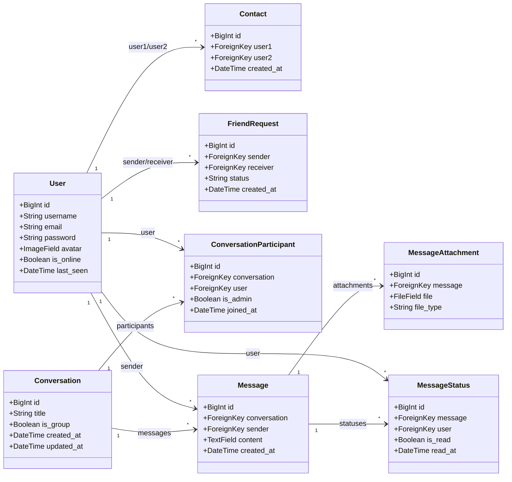
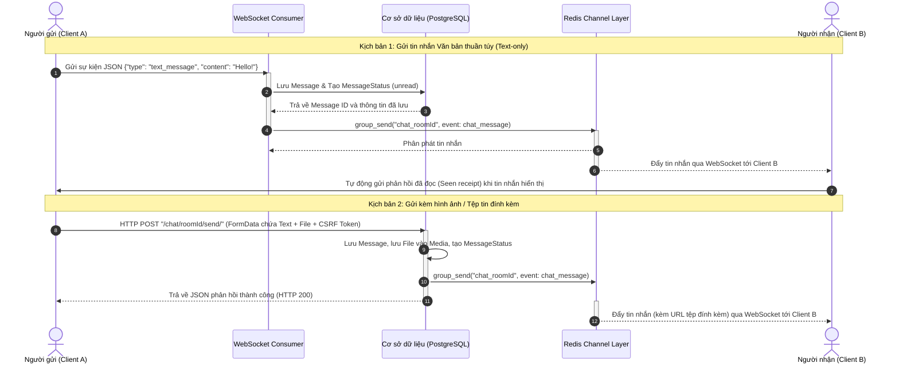

# Kiến trúc & Thiết kế Dự án Real-time Messenger (Django MTV + Channels)

Tài liệu này chi tiết hóa cấu trúc thư mục, thiết kế cơ sở dữ liệu (Database Schema), cấu hình WebSocket (Django Channels), luồng đi của dữ liệu (Data Flow) và các quyết định thiết kế quan trọng cho ứng dụng nhắn tin thời gian thực tương tự Facebook Messenger.

---

## 1. Sơ đồ cây thư mục dự án (Project Structure)

Dự án được tổ chức theo cấu trúc module hóa (nhiều Django Apps riêng biệt) để dễ dàng mở rộng và bảo trì.

```text
Teky_12_Chat/
├── manage.py
├── requirements.txt
├── config/
│   ├── __init__.py
│   ├── asgi.py                 # Cấu hình giao thức HTTP và WebSocket
│   ├── wsgi.py                 # Cấu hình giao thức WSGI truyền thống
│   ├── urls.py                 # Router chính điều hướng các App
│   └── settings/
│       ├── __init__.py
│       ├── base.py             # Cấu hình chung cho mọi môi trường
│       ├── dev.py              # Cấu hình phát triển (SQLite, InMemory Channel)
│       └── prod.py             # Cấu hình production (PostgreSQL, Redis Channel)
├── accounts/                   # Quản lý User, Bạn bè, Lời mời kết bạn
│   ├── __init__.py
│   ├── apps.py
│   ├── forms.py                # Biểu mẫu Đăng ký/Đăng nhập kế thừa AbstractUser
│   ├── models.py               # User, FriendRequest, Contact
│   ├── urls.py
│   └── views.py                # RegisterView, LoginView, FriendListView
├── chat/                       # Logic nhắn tin, phòng trò chuyện
│   ├── __init__.py
│   ├── apps.py
│   ├── models.py               # Conversation, Participant, Message, Attachment, Status
│   ├── urls.py
│   ├── views.py                # Liệt kê hội thoại, trang nhắn tin, upload file
│   ├── routing.py              # Khai báo đường dẫn WebSocket
│   └── consumers.py            # Xử lý kết nối WebSocket (ChatConsumer)
├── notifications/              # Quản lý các thông báo đẩy thời gian thực
│   ├── __init__.py
│   ├── apps.py
│   ├── models.py               # Notification (tin nhắn mới, lời mời bạn bè)
│   ├── context_processors.py   # Inject số lượng thông báo chưa đọc vào template toàn cục
│   ├── urls.py
│   ├── views.py
│   ├── routing.py
│   └── consumers.py            # WebSocket đẩy thông báo (NotificationConsumer)
├── core/                       # App điều phối chung và trang chủ
│   ├── __init__.py
│   ├── apps.py
│   ├── urls.py
│   └── views.py                # IndexView điều hướng đăng nhập/chat
├── templates/                  # Thư mục chứa giao diện DTL (Django Template Language)
│   ├── base.html               # Layout chính, nạp CSS, JS, HTMX và WebSocket thông báo
│   ├── accounts/
│   │   ├── login.html
│   │   ├── register.html
│   │   └── friend_list.html    # Danh sách bạn bè & kết bạn
│   ├── chat/
│   │   ├── conversation_list.html # Giao diện khung danh sách hội thoại bên trái
│   │   ├── conversation_detail.html # Chi tiết cuộc trò chuyện và khung nhập tin nhắn
│   │   └── partials/
│   │       └── message_bubble.html  # Một bong bóng tin nhắn (tách biệt để tái sử dụng)
│   └── notifications/
│       └── notification_list.html
└── static/                     # Chứa tài nguyên tĩnh toàn cục
    └── css/
        └── styles.css          # Hệ thống giao diện hiện đại (glassmorphism/Messenger-like)
```

---

## 2. Vai trò của từng Django App

| Tên App | Vai trò chính |
| :--- | :--- |
| **`accounts`** | Quản lý người dùng. Xử lý đăng ký, đăng nhập, đăng xuất, theo dõi trạng thái `is_online`/`last_seen`. Quản lý quan hệ bạn bè (`Contact`) và gửi/nhận lời mời kết bạn (`FriendRequest`). |
| **`chat`** | Trái tim của ứng dụng. Quản lý phòng chat (cá nhân và nhóm), tin nhắn, tệp đính kèm và trạng thái đã xem/chưa xem của từng tin nhắn. Chứa Consumer xử lý WebSocket thời gian thực. |
| **`notifications`** | Đảm nhận việc lưu trữ và đẩy thông báo thời gian thực khi có sự kiện mới (tin nhắn mới, yêu cầu kết bạn) qua kênh WebSocket riêng biệt. |
| **`core`** | Điều hướng chính (Landing page) và quản lý các trang tĩnh hoặc các logic chung không thuộc về riêng app nào. |

---

## 3. Thiết kế Schema Database (Models) Chi tiết

Thiết kế cơ sở dữ liệu tuân thủ chuẩn quan hệ (Relational DB Schema), tối ưu hóa việc truy vấn và đảm bảo tính toàn vẹn dữ liệu.



### Chi tiết các thực thể:

1. **`User` (Kế thừa `AbstractUser`):**
   * Lưu thông tin tài khoản cơ bản.
   * `avatar`: `ImageField` chứa ảnh cá nhân (mặc định: `avatars/default_avatar.png`).
   * `is_online`: `BooleanField` để hiển thị chấm xanh hoạt động.
   * `last_seen`: `DateTimeField` ghi nhận thời gian offline cuối cùng.

2. **`Contact` (Danh sách bạn bè):**
   * `user1` & `user2`: Liên kết đến `User` (Đảm bảo lưu sao cho `user1.id < user2.id` để tránh trùng lặp bản ghi trùng thứ tự).
   * Ràng buộc: `unique_together = ("user1", "user2")`.

3. **`FriendRequest` (Lời mời kết bạn):**
   * `sender` & `receiver`: Người gửi và người nhận.
   * `status`: `CharField` nhận một trong ba giá trị: `pending` (đang chờ), `accepted` (đồng ý), `rejected` (từ chối).

4. **`Conversation` (Hội thoại):**
   * `title`: Tên nhóm chat (chỉ dùng nếu `is_group=True`, để trống nếu là chat 1-1).
   * `is_group`: Phân biệt chat cá nhân và chat nhóm.
   * `updated_at`: `DateTimeField` tự động cập nhật khi có tin nhắn mới (sắp xếp hội thoại mới nhất lên đầu).

5. **`ConversationParticipant` (Thành viên hội thoại):**
   * Bảng trung gian giải quyết quan hệ Many-to-Many giữa `User` và `Conversation`.
   * `is_admin`: Cấp quyền quản lý (chỉ dành cho chat nhóm).

6. **`Message` (Tin nhắn):**
   * `conversation`: Thuộc cuộc trò chuyện nào.
   * `sender`: Ai gửi.
   * `content`: Nội dung văn bản (có thể trống nếu chỉ gửi file).

7. **`MessageAttachment` (Tệp đính kèm):**
   * `message`: Thuộc tin nhắn nào.
   * `file`: `FileField` lưu trữ tệp đính kèm lên thư mục `media/attachments/`.
   * `file_type`: `CharField` (`image`, `video`, `file`) để hiển thị giao diện phù hợp. Tự động phân loại dựa trên phần mở rộng tệp.
   * Xác thực kích thước: Áp dụng `validate_file_size` (giới hạn 10MB cấu hình từ `settings.py`).

8. **`MessageStatus` (Trạng thái đã đọc - Seen/Unseen):**
   * Quản lý trạng thái đọc tin nhắn của từng thành viên trong cuộc trò chuyện.
   * `is_read`: `BooleanField`.
   * `read_at`: Thời gian đọc tin nhắn.

---

## 4. Danh sách URL Patterns Chính

### accounts/urls.py
* `/accounts/register/` -> `RegisterView` (Đăng ký tài khoản)
* `/accounts/login/` -> `LoginView` (Đăng nhập)
* `/accounts/logout/` -> `LogoutView` (Đăng xuất)
* `/accounts/friends/` -> `FriendListView` (Xem danh sách bạn bè, tìm kiếm bạn bè)
* `/accounts/friends/request/` -> `ManageFriendRequestView` (Gửi, đồng ý, từ chối kết bạn)

### chat/urls.py
* `/chat/` -> `ConversationListView` (Xem tất cả các phòng chat hiện có)
* `/chat/<int:pk>/` -> `ConversationDetailView` (Vào phòng chat cụ thể, lấy lịch sử tin nhắn)
* `/chat/<int:pk>/send/` -> `SendMessageView` (Gửi tin nhắn thông qua HTTP POST - chủ yếu dùng cho upload file/hình ảnh đính kèm)
* `/chat/start/<int:user_id>/` -> `StartPrivateChatView` (Bắt đầu chat 1-1 với một người bạn)

### notifications/urls.py
* `/notifications/` -> `NotificationListView` (Danh sách thông báo)
* `/notifications/read/<int:pk>/` -> `MarkNotificationReadView` (Đánh dấu đã đọc một thông báo)
* `/notifications/read/all/` -> `MarkNotificationReadView` (Đánh dấu đã đọc toàn bộ)

---

## 5. Cấu trúc WebSocket Consumer cho Django Channels

Consumer `ChatConsumer` kế thừa `AsyncWebsocketConsumer` giúp xử lý các sự kiện thời gian thực bằng cơ chế bất tuần tự (Asynchronous) mà không làm tắc nghẽn luồng xử lý chính.

### Cơ chế hoạt động trong `ChatConsumer`:
1. **`connect`**: Xác thực người dùng thông qua `scope["user"]`. Chỉ cho phép kết nối nếu người dùng đã đăng nhập và là thành viên của cuộc trò chuyện (`check_participant`). Thêm kết nối vào group channel `chat_{conversation_id}`. Đánh dấu tất cả tin nhắn cũ là đã đọc và chuyển trạng thái `is_online` của User sang `True`.
2. **`disconnect`**: Rời nhóm channel và cập nhật trạng thái `is_online` của User sang `False` kèm theo thời gian `last_seen`.
3. **`receive`**: Tiếp nhận dữ liệu dạng JSON từ client. Tùy thuộc vào trường `type` để phân loại:
   * **`text_message`**: Gọi hàm `save_message` (thông qua `database_sync_to_async` để ghi dữ liệu an toàn vào DB) và phát tin nhắn (`chat_message`) tới toàn bộ thành viên trong group channel.
   * **`typing`**: Phát sự kiện trạng thái đang nhập (`chat_typing`) tới các thành viên khác trong phòng chat.
   * **`seen`**: Đánh dấu tin nhắn đã đọc trong DB và gửi cập nhật (`chat_seen`) cho người gửi biết.

---

## 6. Luồng dữ liệu (Data Flow) khi gửi tin nhắn

Dự án áp dụng mô hình gửi tin nhắn **Hybrid (Linh hoạt giữa WebSocket và HTTP)** nhằm tối ưu hiệu năng:
* **Tin nhắn văn bản (chỉ chứa text)**: Gửi trực tiếp qua WebSocket giúp tăng tốc độ phản hồi và giảm tải HTTP overhead.
* **Tin nhắn có file đính kèm (ảnh, tài liệu, video)**: Gửi qua HTTP POST (`multipart/form-data`) để Django dễ dàng xác thực CSRF, kiểm soát kích thước file tải lên, sau đó view xử lý sẽ kích hoạt phát phát sóng (broadcast) sự kiện qua Channel layer tới WebSocket.



---

## 7. Giải thích các Quyết định Thiết kế Quan trọng

### A. Tách biệt settings theo môi trường (`base`, `dev`, `prod`)
Giúp cô lập các cấu hình nhạy cảm. Trong quá trình phát triển (`dev`), chúng ta sử dụng SQLite nhẹ nhàng và `InMemoryChannelLayer` mà không cần cài đặt Redis. Khi chạy trên môi trường production (`prod`), hệ thống chuyển sang PostgreSQL mạnh mẽ và dùng Redis làm Channel Layer để chịu tải lớn và phân phối WebSocket đồng bộ đa tiến trình.

### B. Cơ chế xác thực an toàn cho WebSocket
Do WebSocket không hỗ trợ gửi tiêu đề tùy chỉnh (custom headers) trực tiếp trong JavaScript `new WebSocket()`, chúng ta sử dụng `AuthMiddlewareStack` tích hợp sẵn của Django Channels. Cơ chế này tự động đọc Cookie phiên hoạt động (Session Cookie) của người dùng để xác thực người dùng kết nối. Ở `ChatConsumer`, chúng ta thêm bước kiểm tra xem người dùng đó có thực sự thuộc danh sách thành viên của cuộc trò chuyện hay không, tránh lỗ hổng người dùng vào phòng chat của người khác.

### C. Giới hạn kích thước file upload và CSRF
Tại views hoặc validators (`validate_file_size`), kích thước file đính kèm được giới hạn nghiêm ngặt ở mức 10MB để tránh các cuộc tấn công DDoS làm cạn kiệt dung lượng đĩa cứng của máy chủ. Mọi yêu cầu tải tệp lên qua HTTP POST đều được bảo vệ bởi middleware `CsrfViewMiddleware` chuẩn của Django.
